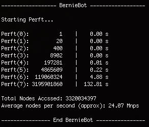

# BernieBot

(IN PROGRESS) Chess Engine I am writing named after my Bunny to teach myself C. Hopefully this engine will be playing on a lichess.org bot account running on a Raspberry Pi coming soon.

Current Project Status: Working on search algorithm -> transposition tables.

Current Perft Speed:    <strike>4-5M</strike>
                        24M nodes/sec*

* Single threaded on my 2.3GHz Intel i5 MacBook Pro, not running evaluation function at each node, not bulk counting horizon nodes, no hashing. For reference, the fastest move generation function I know of, [qperft](https://home.hccnet.nl/h.g.muller/dwnldpage.html) by H.G. Muller, runs at about 80-90 Mnps on my machine while bulk counting the horizon nodes.
